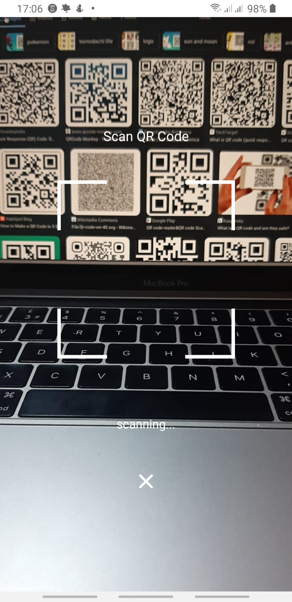
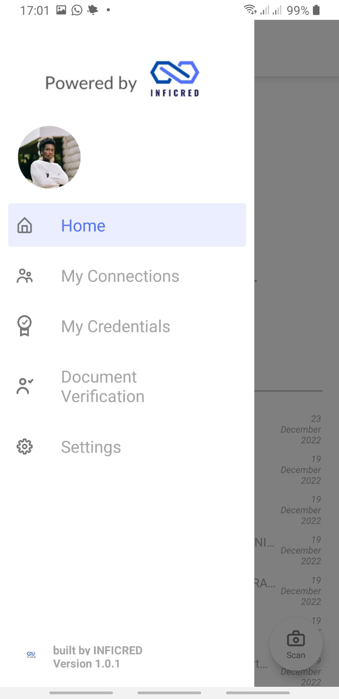
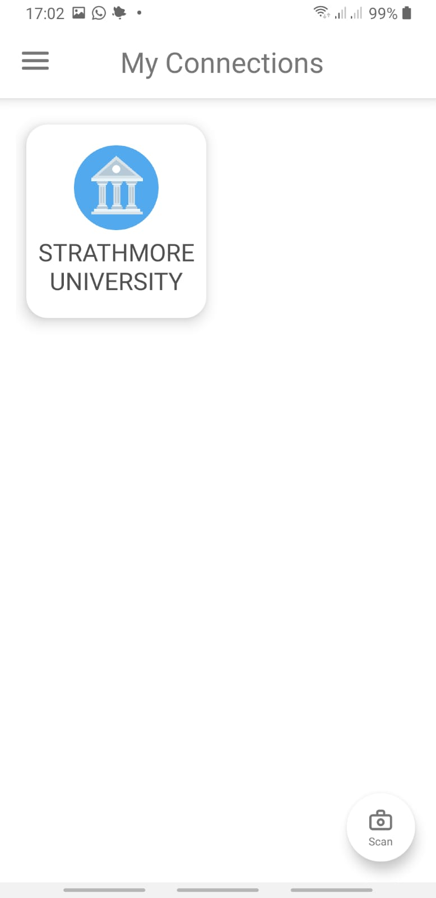
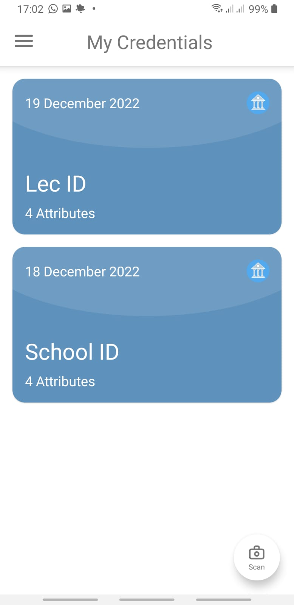
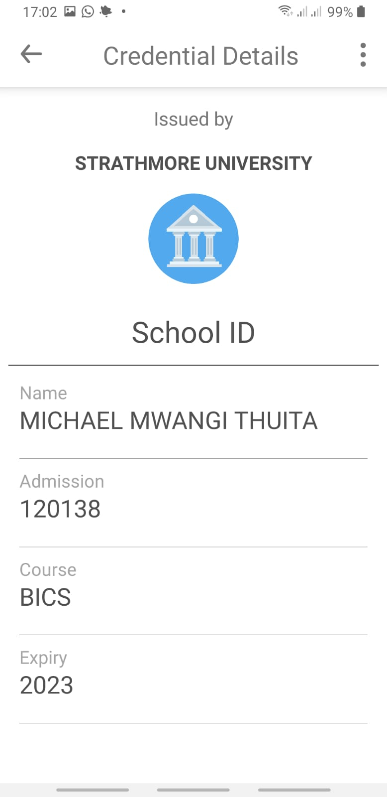

# inficred-mobile
With today's world filled with information and data, it is very important for us to distinguish what information or data is authentic and what is fraudulent. Inficred is a digital identity wallet that resides in the user’s mobile phone of which they can store their personal documents and use them to verify their identity when needed governed by a self-sovereign identity approach. The goal is to have a single source of truth, and this will be achieved by having verified organizations issue out these documents directly to the user’s digital wallet.

## Preview of the app's interfaces.

